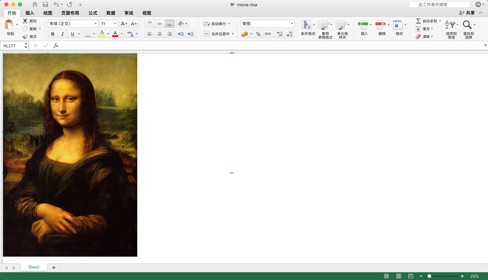

# 使用Python在Excel里面画画
## 起因
之前看到过很多头条，说哪国某人坚持了多少年自学使用excel画画，效果十分惊艳。对于他们的耐心我十分敬佩，但是作为一个程序员，自然也得挑战一下自己。这种需求，我们十分钟就可以完成！
## 使用技术
* [Python3.7](https://www.python.org/downloads/release/python-370/)
* [PIL]()
* [openpyxl]()
## 最终效果

